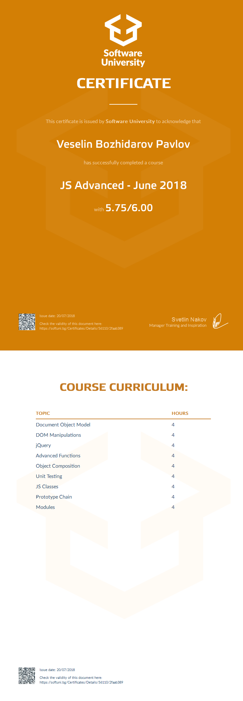

<a href="https://softuni.bg/trainings/courses" rel="Courses">  ![SoftUni logo][logo] <a/>

[logo]: http://innovationstarterbox.bg/wp-content/uploads/2016/05/Softuni_logo_trasparent.png "Logo Title Text 2"

---
The JavaScript Advanced course extends the JavaScript Fundamentals skills with more sophisticated concepts and principles of functional programming (FP) and object-oriented programming (OOP) with JavaScript, as well as the use of DOM to process the elements in a web page. The course is based on state-of-the-art standards and JS technologies (JavaScript is being studied with ES2017).

The course starts by studying the JavaScript object object (DOM and BOM) and interacting with it from JavaScript: searching, editing and deleting DOM tree elements, event processing, interaction with the web browser.

In-depth study of functions and paradigms from functional programming (FP): function as object, functional expressions, higher order functions, IIFE, JS objects and JSON, object composition, higher order functions, closure, JS templates such as revealing module, prototype object inheritance and prototype chain, work with generators and iterators.

Objective-oriented programming (OOP) with JavaScript classes is considered: class defining, constructors, properties and methods, class inheritance, antitype chains, polymorphism, other types of OOP and inheritance. Serious attention is paid to unit testing and its application in software engineering to build quality software.

The course also includes work with module systems such as ES6 modules, CommonJS, RequireJS and module dependency management, transpellers such as Babel, error handling and exception handling, established practices and templates for writing quality and reusable JavaScript code.

# Course: JavaScript Advanced

## Topics:
01. Document Object Model
02. DOM Manipulation
03. JQuery
04. Advanced Functions
05. Object Composition
06. Unit Testing
07. JS Classes
08. Prototype Chain
09. Modules

## Certificate:

 
